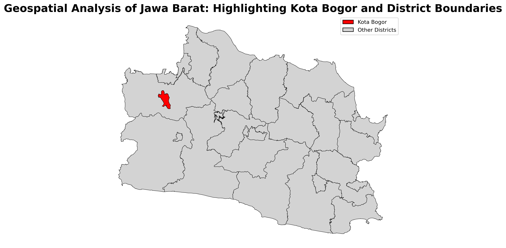

# Geospatial Analysis of West Java: Highlighting Bogor City and District Boundaries

## Final Result

The image above is the final output of this project, which highlights the boundaries of Bogor City within the West Java region. The visualization was generated using Python and geospatial libraries, and it effectively showcases the geographic distribution and administrative boundaries.

## Project Overview

This project focuses on the geospatial analysis of West Java, with a specific emphasis on highlighting the boundaries of Bogor City and the surrounding districts. The objective is to visualize and analyze the geographic distribution and administrative boundaries within the region using Python and various geospatial libraries.

## Project Structure

The project consists of the following main components:

- **`data/`**: Contains the geospatial data files, including the shapefile (`pulau_jawa_kab`) and associated files needed for analysis.
- **`geospatial_analysis_west_java.ipynb`**: Jupyter notebook that performs the geospatial analysis, including data loading, processing, and visualization.
- **`bogor_west_java.png`**: The final result of the analysis, highlighting Bogor City within the West Java region.

## Tools and Libraries

- **Python**: The primary programming language used for the analysis.
- **GeoPandas**: A Python library used for working with geospatial data, including reading shapefiles and performing spatial operations.
- **Matplotlib**: A Python plotting library used for visualizing the geographic data.
- **JupyterLab**: An interactive development environment used for running the analysis and visualizations.

## Data Source

The geospatial data used in this project comes from the [Indonesia Geospasial](https://www.indonesia-geospasial.com/) and includes shapefiles representing the administrative boundaries of West Java.
